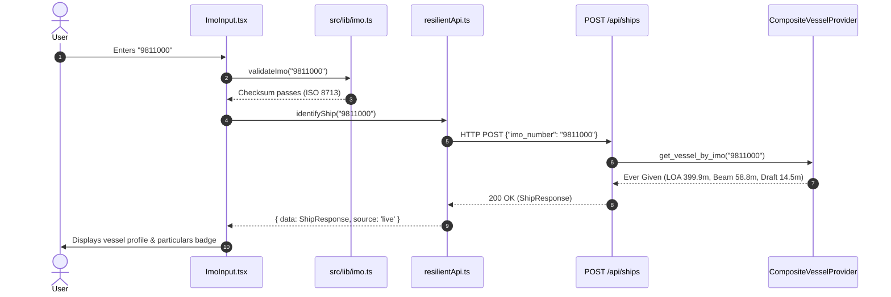
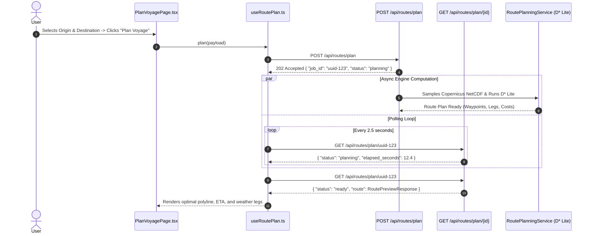
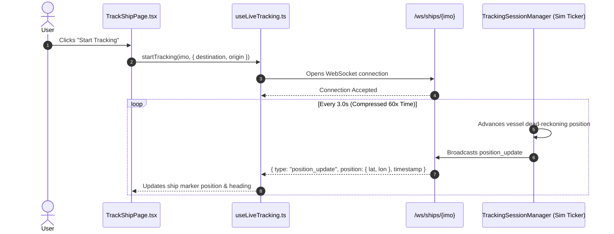

# NauDisha — Full-Stack System Architecture & Integration Guide

**Version:** 2.0  
**Date:** August 16, 2026  
**Status:** Production-Ready & Verified  

---

## 1. System Topology & Overview

NauDisha is an advanced marine weather-routing and real-time vessel tracking platform. It ingests live oceanographic and atmospheric forecasts (Copernicus Marine Service, Open-Meteo), vessel static and dynamic particulars (Wikidata, AISStream), models hydrodynamic resistance across 6 environmental objectives, and optimizes navigation tracks using dynamic $D^*$ Lite graph search.

```
+---------------------------------------------------------------------------------------------------+
|                                       BROWSER CLIENT (REACT 19 / VITE)                            |
|                                                                                                   |
|   +--------------------------+   +--------------------------+   +-----------------------------+   |
|   |     LandingPage.tsx      |   |    PlanVoyagePage.tsx    |   |      TrackShipPage.tsx      |   |
|   +------------+-------------+   +------------+-------------+   +--------------+--------------+   |
|                |                              |                                |                  |
|                +------------------------------+--------------------------------+                  |
|                                               |                                                   |
|                        +----------------------v-----------------------+                           |
|                        |      useRoutePlan / useLiveTracking Hooks    |                           |
|                        +----------------------+-----------------------+                           |
|                                               |                                                   |
|                        +----------------------v-----------------------+   +-------------------+   |
|                        |      Resilient API Layer (Dual-Mode)         |<--+ DataSourceConsole |   |
|                        +----------+-----------------------+-----------+   +-------------------+   |
|                                   |                       |                                       |
|             +---------------------v-----+   +-------------v-------------+                         |
|             | HTTP Transport Layer      |   | Live WebSocket Transport  |                         |
|             | (services/apiClient.ts)   |   | (services/liveSocket.ts)  |                         |
|             +-------------+-------------+   +-------------+-------------+                         |
+---------------------------|-------------------------------|---------------------------------------+
                            |                               |
                   HTTP/REST (Port 5173 -> 8000)      WS (ws://127.0.0.1:8000)
                            |                               |
+---------------------------v-------------------------------v---------------------------------------+
|                                    FASTAPI BACKEND (UVICORN / PORT 8000)                          |
|                                                                                                   |
|   +-------------------------------------------------------------------------------------------+   |
|   |                               API Routers & Contract Handlers                             |   |
|   |         /health | /ready | /api/ships | /api/routes/* | /api/ships/{imo}/tracking/*       |   |
|   +--------------------+----------------------------------+-----------------------------------+   |
|                        |                                  |                                       |
|          +-------------v-------------+      +-------------v-------------+                         |
|          |    PlanningManager        |      |  TrackingSessionManager   |                         |
|          |  (ThreadPool & Signature) |      |   (Sim Navigation Ticker) |                         |
|          +-------------+-------------+      +-------------+-------------+                         |
|                        |                                  |                                       |
|                        +------------------+---------------+                                       |
|                                           |                                                       |
|                                +----------v----------+                                            |
|                                | RoutePlanningService|                                            |
|                                +----------+----------+                                            |
|                                           |                                                       |
|        +---------------------+------------+------------+---------------------+                    |
|        |                     |                         |                     |                    |
| +------v------+       +------v------+           +------v------+       +------v------+             |
| |   D* Lite   |       | Multi-Factor|           |  Copernicus |       |  Composite  |             |
| | Path Engine |       | Cost Model  |           | & Open-Meteo|       | Vessel AIS  |             |
| +-------------+       +-------------+           +-------------+       +-------------+             |
+---------------------------------------------------------------------------------------------------+
```

---

## 2. Backend Architecture & Working Mechanics

The backend source code is located in `backend/naudisha/` and is divided into three distinct layers:
1. **API Layer (`naudisha/api/`)**: HTTP endpoints, WebSocket handlers, Pydantic wire schemas, and state managers.
2. **Core Domain Layer (`naudisha/core/`)**: Graph routing algorithms, hydrodynamic cost formulas, and domain data models.
3. **Data Provider Layer (`naudisha/data/`)**: External meteorological and vessel data ingestion.

```
backend/naudisha/
├── api/
│   ├── main.py          # FastAPI application factory, CORS, lifespan simulation ticker
│   ├── routes.py        # REST endpoints and WebSocket route controllers
│   ├── schemas.py       # Pydantic validation models matching API Contract v2
│   ├── errors.py        # Exception hierarchy and contract error response formatting
│   ├── planning.py      # Background ThreadPool planning manager with deduplication
│   ├── services.py      # Route planning service orchestrator
│   └── tracking.py      # TrackingSession registry and dead-reckoning simulator ticker
├── core/
│   ├── dstar_lite.py    # D* Lite incremental dynamic graph search implementation
│   ├── cost_model.py    # Multi-factor environmental and safety edge cost evaluation
│   ├── calculations.py  # Great-circle Haversine, bearing, and unit conversions
│   └── models.py        # Domain entities (ShipProfile, RouteLeg, EnvironmentalState)
└── data/
    ├── copernicus_provider.py  # Copernicus Marine Service netCDF current & wave client
    ├── openmeteo_provider.py   # Open-Meteo marine & atmospheric weather API client
    ├── aisstream_provider.py   # AISStream.io live vessel transponder WebSocket client
    ├── wikidata_provider.py    # Vessel static particulars lookup via Wikidata SPARQL
    └── vessel_provider.py      # Composite fallback chain (Wikidata -> AIS -> Catalogue)
```

---

### 2.1 The Routing Engine ($D^*$ Lite & 4-Connected Grid)

- **Algorithm:** NauDisha implements Lifelong Planning $A^*$ / $D^*$ Lite in [`dstar_lite.py`](file:///c:/Users/VISHESH/Desktop/naudisha/backend/naudisha/core/dstar_lite.py).
- **Topology:** The ocean space is modeled as a 4-connected spatial grid (North, South, East, West steps).
- **Dynamic Replanning:** Unlike static Dijkstra or standard $A^*$, $D^*$ Lite maintains a priority queue of vertices with inconsistent $g$ and $rhs$ values. When weather forecast conditions shift mid-voyage, $D^*$ Lite updates only the affected graph edges without recomputing the entire path from scratch.

---

### 2.2 Multi-Factor Environmental Cost Model

The cost of traversing an edge between two marine coordinates is computed in [`cost_model.py`](file:///c:/Users/VISHESH/Desktop/naudisha/backend/naudisha/core/cost_model.py) as a normalized, dimensionless weighted sum across six distinct components:

$$\text{Cost} = w_t S_{\text{time}} + w_f S_{\text{fuel}} + w_w S_{\text{wind}} + w_v S_{\text{wave}} + w_c S_{\text{current}} + w_s S_{\text{safety}}$$

| Factor | Metric Evaluated | Physical Modeling Effect |
| :--- | :--- | :--- |
| **$S_{\text{time}}$** | Travel Duration | Speed over ground ($V_g = V_c + V_{\text{along}}$) divided by distance. |
| **$S_{\text{fuel}}$** | Hydrodynamic Resistance | Cubic engine power curve ($P \propto V^3$) with wave/wind added drag. |
| **$S_{\text{wind}}$** | Relative Wind Velocity | Angle of attack relative to heading (0° headwind = heavy penalty; 180° tailwind = assist). |
| **$S_{\text{wave}}$** | Significant Wave Height ($H_s$) | Quadratic resistance penalty when wave height exceeds vessel draft thresholds. |
| **$S_{\text{current}}$**| Along-Track Ocean Current | Vector projection of surface drift onto vessel course. Positive assists; negative opposes. |
| **$S_{\text{safety}}$** | Environmental Hazard Margin | Heavy non-linear penalty for extreme sea states ($H_s > 4.0\text{ m}$ or wind $> 35\text{ kn}$). |

---

### 2.3 Asynchronous Planning Manager (`planning.py`)

- **Why it exists:** Cold route planning requires fetching netCDF ocean datasets from Copernicus Marine Service, taking 75–85s on the initial query.
- **Workflow:**
  1. `POST /api/routes/plan` queues the calculation onto a dedicated `ThreadPoolExecutor` (max 4 workers).
  2. The server instantly returns `202 Accepted` with a UUID `job_id` and `status: "planning"`.
  3. The frontend polls `GET /api/routes/plan/{job_id}` every 2.5 seconds until `status: "ready"`.
- **Deduplication:** Multiple requests with identical voyage coordinates share a normalized `signature` cache key and join the same worker thread task rather than issuing duplicate upstream queries.
- **Cache TTL:** Completed routes are cached for 30 minutes (`RESULT_CACHE_TTL_SECONDS = 1800.0s`).

---

### 2.4 Live Navigation Simulator & Tracking Manager (`tracking.py`)

- **Centralized Ticker:** A single background asyncio task ([`_run_ticker`](file:///c:/Users/VISHESH/Desktop/naudisha/backend/naudisha/api/tracking.py#L439-L449)) steps all active tracked voyages at 3.0s real-time intervals (`TICK_SECONDS = 3.0`), compressed by a 60x simulation factor (`TIME_SCALE = 60.0`).
- **Dead Reckoning & Route Pruning:** Consumed waypoints are pruned in [`remaining_route`](file:///c:/Users/VISHESH/Desktop/naudisha/backend/naudisha/api/tracking.py#L187-L203) so that queries to `GET /api/ships/{imo}/route` always return remaining waypoints starting from current vessel position.
- **Dynamic Replanning:** Sessions re-evaluate weather and trigger automatic replanning after position advance if conditions change or replan timer elapses (`REPLAN_INTERVAL_SECONDS = 45s`).
- **Thread Safety:** Cross-thread delivery from planning worker threads to client WebSocket queues on the asyncio loop uses `sub.loop.call_soon_threadsafe(_offer, ...)`.

---

## 3. Frontend Architecture & Working Mechanics

The frontend source code is located in `frontend/src/` built on **React 19**, **Vite 8**, **TypeScript**, and **Tailwind CSS v4**.

```
frontend/src/
├── components/
│   ├── devtools/DataSourceConsole.tsx  # Telemetry bus visualizer & live/mock switcher
│   ├── layout/                         # Header, AppLayout, BackendStatusPill, ThemeToggle
│   ├── route/                          # LocationSearch, LocationPicker, RouteExplanation, RouteStatsPanel
│   ├── ship/                           # ImoInput, ShipInfoPanel, ShipParticularsForm
│   └── ui/                             # Button, Card, Badge, Input, ShipAnimation, LottiePlayer
├── hooks/
│   ├── useBackendHealth.ts             # Health & readiness probe polling hook
│   ├── useLiveTracking.ts              # Real-time WebSocket voyage tracking & state machine
│   ├── useRoutePlan.ts                 # Asynchronous route submission & poll coordinator
│   ├── useTelemetry.ts                 # Telemetry subscription hook for devtools
│   └── useTheme.tsx                    # Dark/light mode theme management
├── lib/
│   ├── explain.ts                      # Natural language route & leg explanation generator
│   ├── format.ts                       # Nautical distance, duration, coordinate formatters
│   ├── geo.ts                          # Haversine, bearing, pointAlongPath, Leaflet boundsOf
│   ├── imo.ts                          # Authoritative ISO 8713 check digit validator
│   ├── ports.ts                        # Regional port approaches & fuzzy search
│   └── utils.ts                        # Tailwind class merger (cn) and uid generator
├── map/
│   ├── MapCanvas.tsx                   # Leaflet map container with OpenSeaMap marine overlay
│   └── markers.ts                      # Custom SVG icons for vessels, ports, waypoints, hazards
├── pages/
│   ├── LandingPage.tsx                 # Entry navigation and flow selection
│   ├── PlanVoyagePage.tsx              # Pre-voyage planning and manual particulars entry
│   └── TrackShipPage.tsx               # Active underway vessel tracking and storm simulation
├── services/
│   ├── apiClient.ts                    # Typed 1-to-1 contract endpoint network calls
│   ├── http.ts                         # Fetch wrapper with timeout, retry, and error classification
│   ├── liveSocket.ts                   # WebSocket client with backoff, ordering, and Zod parser
│   ├── resilientApi.ts                 # Live-vs-Mock fallback policy and error unmasking
│   ├── schemas.ts                      # Runtime Zod validation schemas for all contract payloads
│   └── telemetry.ts                    # In-memory telemetry event recorder and bus
└── types/
    └── api.ts                          # TypeScript interface definitions for API Contract v2
```

---

### 3.1 Resilient Dual-Mode Execution (`resilientApi.ts`)

The frontend guarantees uninterrupted operation while maintaining strict input truthfulness:
1. **Never Mask 4xx Client Errors:** If an IMO check digit fails or coordinates are invalid, the error is passed through directly to the UI. It is never masked with fake data.
2. **Graceful Fallback on Network / Server Outages:** If the backend is offline or returns a 5xx error, the client transparently switches to verified mock fixtures and flags the UI with a `MOCK` badge.
3. **Telemetry Bus:** Every API call, status code, latency, and fallback rationale is broadcast to [`telemetry.ts`](file:///c:/Users/VISHESH/Desktop/naudisha/frontend/src/services/telemetry.ts) and visible inside the devtools [`DataSourceConsole.tsx`](file:///c:/Users/VISHESH/Desktop/naudisha/frontend/src/components/devtools/DataSourceConsole.tsx).

---

### 3.2 WebSocket Streaming Transport (`liveSocket.ts`)

- Opens `ws://localhost:8000/ws/ships/{imo_number}` without requiring manual subscriptions.
- Validates inbound messages against Zod schemas ([`liveMessageSchema`](file:///c:/Users/VISHESH/Desktop/naudisha/frontend/src/services/schemas.ts#L155-L158)).
- Enforces strict chronological ordering based on message ISO timestamps to prevent out-of-order jitter.
- Uses exponential backoff with jitter on disconnect, and triggers a full REST re-sync ([`syncOnce`](file:///c:/Users/VISHESH/Desktop/naudisha/frontend/src/hooks/useLiveTracking.ts#L341-L407)) upon reconnecting to restore state per Contract §9.

---

## 4. End-to-End Operational Lifecycle

### Flow A: Identifying a Vessel


---

### Flow B: Voyage Planning


---

### Flow C: Real-Time Live Tracking


---

## 5. Developer Quick-Start & Operations

### Dual-Terminal Execution

To run the complete system locally with live integration:

#### Terminal 1 — Backend Server
```powershell
cd c:\Users\VISHESH\Desktop\naudisha\backend
py -m uvicorn naudisha.api.main:app --host 127.0.0.1 --port 8000 --reload
```
- **Health Check:** [http://localhost:8000/health](http://localhost:8000/health)
- **API Documentation:** [http://localhost:8000/docs](http://localhost:8000/docs)

#### Terminal 2 — Frontend UI
```powershell
cd c:\Users\VISHESH\Desktop\naudisha\frontend
npm run dev
```
- **Web Application:** [http://localhost:5173](http://localhost:5173)

---

## 6. Verification Status Summary

| Area | Component | Verification Status |
| :--- | :--- | :--- |
| **Backend Unit Tests** | `backend/tests/` | **211 of 211 tests passed (100% OK)** |
| **Frontend TypeScript** | `frontend/src/` | **0 errors (`tsc -b && vite build` in 739ms)** |
| **API Contract** | `docs/API_CONTRACT.md` | **Strict v2 compliance across all 10 endpoints** |
| **Data Ingestion** | Open-Meteo / Copernicus | **Working with real-time ocean grid sampling** |
| **Live Tracking** | WebSocket Ticker | **Tested and validated with continuous frame streams** |
| **Resilience** | Dual-Mode Fallback | **Verified with real-time status pill switching** |
